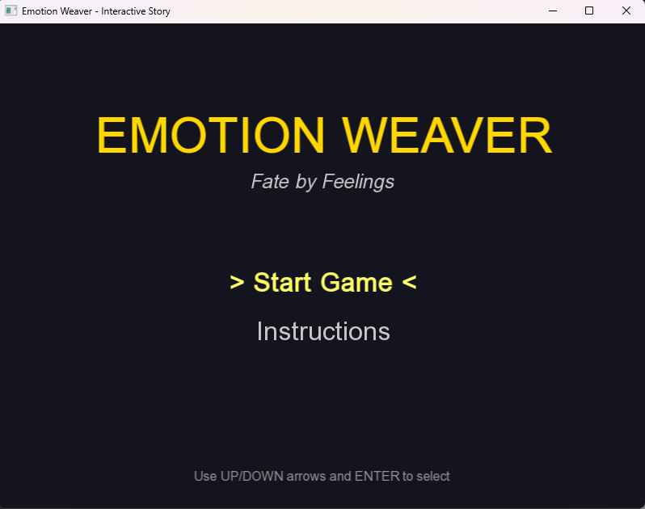
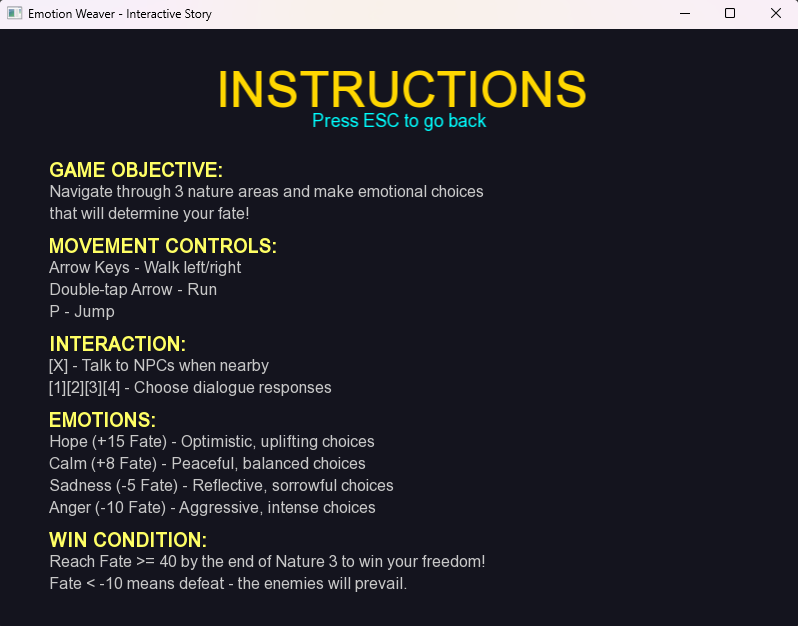
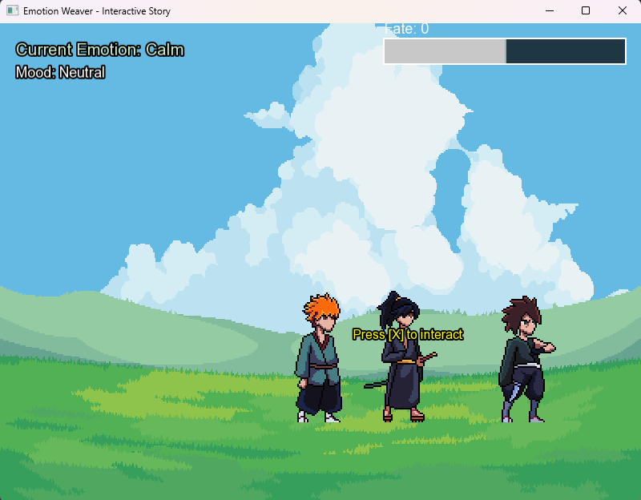
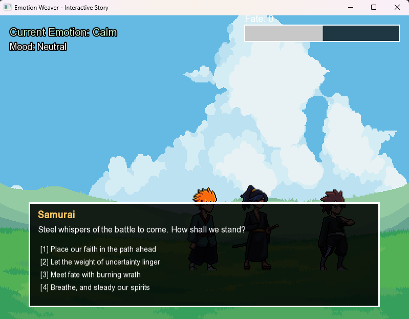
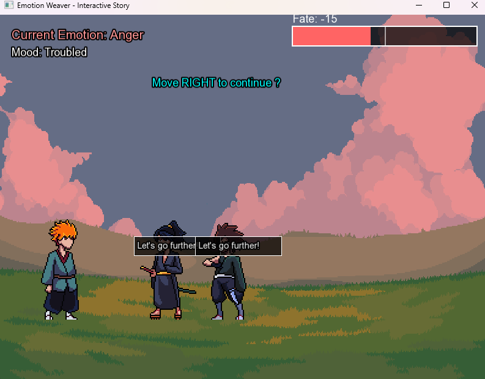
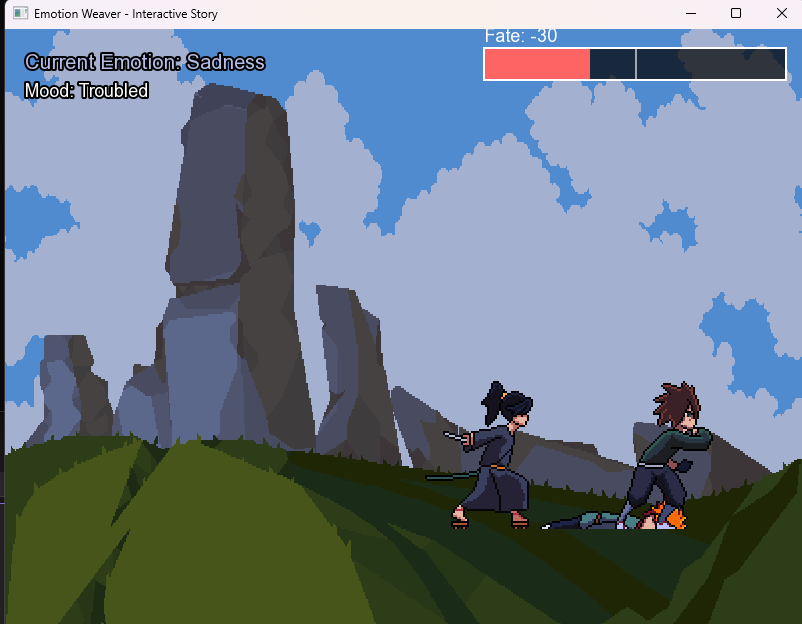
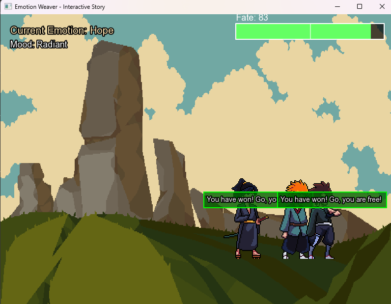

# Emotion Weaver – Fate by Feelings

Emotion Weaver is a narrative-driven visual novel built in **C++ using SFML**.
The game centers around emotionally driven choices, branching dialogue, and a fate system that determines the player’s outcome.

Players navigate multiple story areas, interact with characters, and make decisions that influence emotional states such as Hope, Calm, Anger, and Sadness — ultimately shaping the story’s ending.

---

## Features
- Custom dialogue system with multiple response options
- Emotion system that dynamically affects story progression
- Fate meter influenced by player choices
- Character interaction system
- Menu and instruction screens built with SFML
- Scenario and scene management
- Asset management for textures and audio

---

## Screenshots

### Main Menu

### Instructions Screen

### Character Interaction

### Dialogue System

### Emotion Progression System

### Loss Condition

### Victory Ending

---

## Technologies Used
- **C++**
- **SFML**
- Object-Oriented Programming
- State-based game architecture
- Visual Studio

---

## Project Structure

---

## How to Build & Run
1. Open the project in **Visual Studio**
2. Ensure **SFML** is properly installed and linked
3. Build the project in Debug or Release mode
4. Run the executable from Visual Studio

> Note: SFML binaries are not included and must be installed separately.

---

## What I Learned
- Designing modular systems for narrative-driven games
- Managing game state and branching dialogue in C++
- Implementing an emotion-based decision system
- Structuring a medium-sized C++ project
- Using SFML for rendering, input, and UI

---

## Future Improvements
- Save and load system
- Expanded branching storylines
- Additional emotional states and outcomes
- Audio and visual polish

---

## License
This project is licensed under the MIT License.
